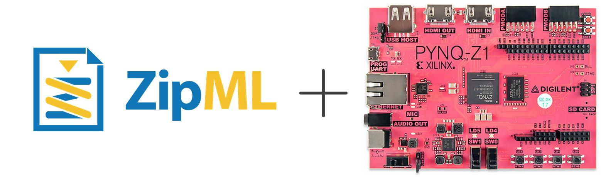
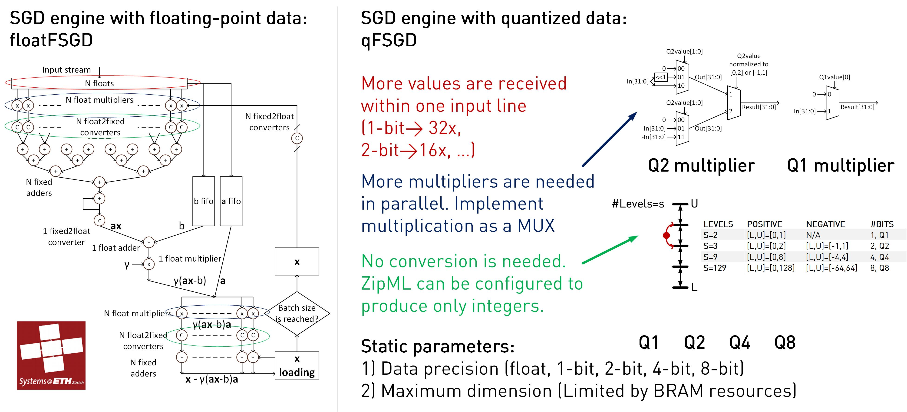

# ZipML-PYNQ

This repository contains the project to perform linear model training using stochastic gradient descent (SGD) on PYNQ.
The training can be performed on either full or low precision (8, 4, 2 and even 1-bit!) data, to accelerate SGD up to 3 orders of magnitude on PYNQ.
Necessary Python classes are provided to interact with the FPGA acceleration in an easy and abstract way.

## Citation

If you find ZipML-PYNQ useful, please consider citing ZipML papers:

	@inproceedings{kara2017fpga,
	title={FPGA-accelerated Dense Linear Machine Learning: A Precision-Convergence Trade-off},
	author={Kara, Kaan and Alistarh, Dan and Alonso, Gustavo and Mutlu, Onur and Zhang, Ce},
	booktitle={Field-Programmable Custom Computing Machines (FCCM), 2017 IEEE 25th Annual International Symposium on},
	pages={160--167},
	year={2017},
	organization={IEEE}
	}

	@inproceedings{zhang2017zipml,
	title={ZipML: Training Linear Models with End-to-End Low Precision, and a Little Bit of Deep Learning},
	author={Zhang, Hantian and Li, Jerry and Kara, Kaan and Alistarh, Dan and Liu, Ji and Zhang, Ce},
	booktitle={International Conference on Machine Learning},
	pages={4035--4043},
	year={2017}
	}

## Quick start

sudo pip3.6 install --upgrade git+https://github.com/fpgasystems/ZipML-PYNQ

(Using Jupyter notebooks)
1. Connect to the Jupyter Notebooks server running on your PYNQ (http://pynq.readthedocs.io/en/latest/jupyter_notebooks.html)
2. Open ZipML-Notebooks
3. Explore L2SVM_MNIST (SVM training using handwritten digit images) or LINREG_YEARPREDICTIONMSD (linear regression for year prediction using extracted features from audio).

(Using test_*.py files)
1. $ git clone https://github.com/fpgasystems/ZipML-PYNQ
2. $ Get the datasets using ./zipml/Notebooks/get_mnist.sh and ./zipml/Notebooks/get_yearpredictionMSD.sh
3. $ sudo python3.6 ./tests/test_pynq_mnist.py --train /path/to/mnist --test /path/to/mnist.t
4. $ sudo python3.6 ./tests/test_pynq_YearPredictionMSD.py --train /path/to/YearPredictionMSD

## Repo organization

- zipml: contains the Python classes and pre-built bitstreams, ready to deploy on the PYNQ right out of the box.
- zipml/Notebooks: contains Jupyter notebooks, showing how to perform SVM training on mnist or linear regression on YearPredictionMSD.
- tests: Python scripts, using the ZipML_SGD class to perform training.
- RTL: contains VHDL files, that are the core of the FPGA-accelerated full and low precision SGD.
- xlnx_ip: necessary floating-point IP cores generated with Vivado.
- scripts: TCL scripts to build a new Vivado project and a new bitstream, if one wishes to change the hardware design.

## Rebuilding the hardware design

1. Clone the project in you development machine, which has Vivado installed (tested with Vivado 2017.1)
2. $ export PYNQ_SGD_ROOT=/path/to/ZipML-PYNQ/
3. $ ./make_hw <quantization_bits> (0=full precision, 1, 2, 4 or 8)
4. Wait until the process finishes. Then you can find the new bitstream and .tcl file in $PYNQ_SGD_ROOT/output/pynq-sgd-vivado-Qx/pynq-sgd-vivado-Qx.runs/impl_1/